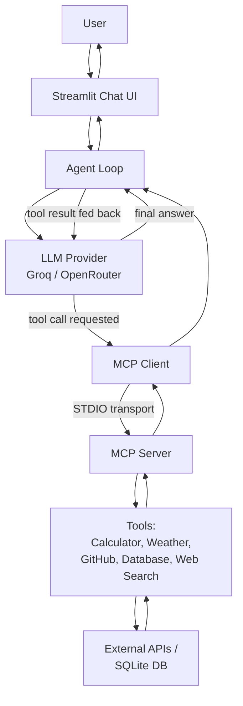
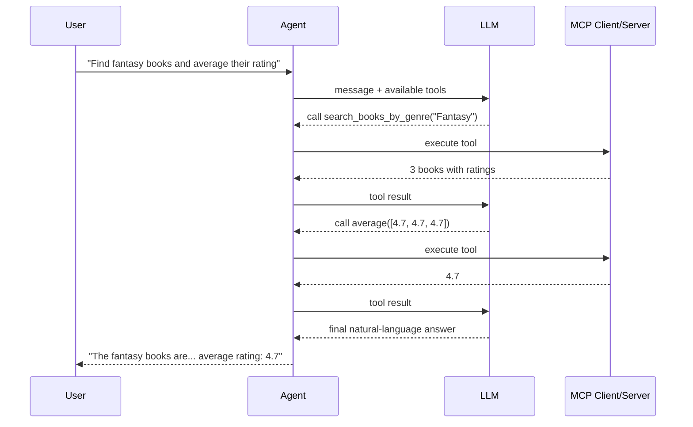

# MCP Multi-Model AI Agent

A portfolio-grade AI agent demonstrating real **Model Context Protocol (MCP)** tool-calling, multi-step reasoning, and provider-agnostic LLM integration — built from scratch to understand the architecture, not hide it behind a framework.

## Problem Statement

LLMs can't act on the world by themselves — they can't check live weather, search GitHub, query a database, or do reliable arithmetic. This project builds a genuine **agent**: a system where an LLM decides *when* a tool is needed, discovers *what* tools exist, and invokes them through the real, standardized MCP protocol — chaining multiple tools together when a single tool isn't enough.

## Why MCP?

Before MCP, connecting an LLM to a tool meant writing custom, one-off integration code for every tool/model combination. MCP standardizes this: any MCP-compliant client can discover and call any MCP-compliant server's tools, regardless of which LLM is driving the conversation. This project implements the **current MCP specification (2026-07-28)** using the **official Python MCP SDK v2.0.0** — a stateless architecture that removed the older session/handshake model in favor of per-request protocol versioning.

## Features

- **Real MCP server & client** — not simulated tool-calling, genuine protocol-level discovery and invocation over STDIO transport
- **15 tools across 5 categories**: calculator, weather, GitHub, local SQLite database, web search
- **Multi-step tool chaining** — the LLM autonomously sequences multiple tool calls (e.g., search GitHub → calculate an average) with no hardcoded orchestration
- **Multi-provider LLM support** — switch between Groq and OpenRouter via a single environment variable, no code changes
- **Graceful error handling** — tool failures and LLM-call failures are caught, logged, and explained to the user in plain language instead of crashing
- **Structured logging** — every request, tool call, timing, and error is logged to console and file
- **27 automated tests** — unit, integration, and end-to-end coverage
- **Streamlit chat UI** — shows the active model, live tool list, and exactly which tools were used per response

## Architecture



## Tool-Calling Workflow (Multi-Step Example)



## Tech Stack

| Component | Choice | Why |
|---|---|---|
| Language | Python 3.12 | Comfortable baseline, strong async support |
| MCP SDK | `mcp[cli]` v2.0.0 | Official SDK, current stateless (2026-07-28) protocol |
| LLM Providers | Groq, OpenRouter | Genuinely free tiers, OpenAI-compatible tool-calling |
| Frontend | Streamlit | Fast to build, sufficient for demonstrating architecture |
| Database | SQLite | Zero-setup, sufficient for a small read-only demo dataset |
| Weather API | Open-Meteo | No API key required, generous free usage |
| Web Search | Tavily | Free tier (1,000 searches/month), built for LLM agents |
| Testing | pytest, pytest-asyncio | Standard, supports async MCP calls |

## Project Structure

mcp-agent/
├── app/
│ ├── agent/agent.py # Core agent loop (multi-step tool chaining)
│ ├── llm/ # Provider abstraction (Groq, OpenRouter, Gemini)
│ ├── mcp_server/ # MCP server + 15 tools
│ ├── database/ # SQLite setup + safe read-only queries
│ └── logger.py # Structured logging
├── frontend/app.py # Streamlit chat UI
├── tests/ # 27 tests: unit, integration, e2e
├── .env.example
└── requirements.txt


## Installation

```powershell
git clone https://github.com/WazzanKhan30/mcp-multi-model-ai-agent.git
cd mcp-multi-model-ai-agent
python -m venv venv
.\venv\Scripts\Activate.ps1
pip install -r requirements.txt
```

## Environment Variables

Copy `.env.example` to `.env` and fill in your own free API keys:

LLM_PROVIDER=groq
GROQ_API_KEY= # https://console.groq.com/keys
OPENROUTER_API_KEY= # https://openrouter.ai/keys (optional)
GITHUB_TOKEN= # https://github.com/settings/tokens
TAVILY_API_KEY= # https://tavily.com


## Running Locally

```powershell
# Seed the database (one-time)
python app\database\setup_db.py

# Launch the chat UI
streamlit run frontend\app.py
```

## Example Interactions

| Question | Tools Used |
|---|---|
| "What is 25% of 8000?" | `percentage_of` |
| "What's the weather in Mumbai?" | `get_weather` |
| "Find top 5 Python AI repos on GitHub and their average stars" | `search_github_repos` → `average` |
| "What fantasy books do you have, and their average rating?" | `search_books_by_genre` → `average` |

## Multi-Model Support

Switch providers with one line in `.env`:

LLM_PROVIDER=groq # or: openrouter

No code changes required — both providers implement the same `generate(messages, tools)` interface.

**Known limitation:** a Gemini provider is implemented (`app/llm/gemini_provider.py`) but currently blocked by an account-level Google API restriction (`403: Your project has been denied access`) unrelated to this code — a widely-reported issue affecting many new Google AI Studio projects. OpenRouter's free-tier model availability also fluctuates (models are periodically deprecated or rate-limited); the provider abstraction itself is verified working against multiple models.

## Testing

27 automated tests across 4 layers:
- **Unit tests** (19): calculator and database logic in isolation
- **Integration tests** (5): real MCP client↔server communication over STDIO
- **End-to-end tests** (3): full agent loop with real LLM calls, including multi-step chaining

```powershell
python -m pytest -v
```

A genuine finding from testing: LLM-generated answers vary in formatting (e.g., "2000" vs "2,000") even when numerically correct — tests were adjusted to normalize output rather than expect exact string matches, since LLM output correctness isn't equivalent to deterministic string equality.

## Performance

From `tests/benchmark.py` (4 representative questions):

| Question Type | Total Time | Tool Calls |
|---|---|---|
| Simple calculator (1 tool) | ~6.7s | 1 |
| Weather lookup (1 tool, external API) | ~9.9s | 1 |
| Multi-step chaining (2 tools) | ~7.1s | 2 |
| GitHub search + calculator (3 tools) | ~49.3s* | 3 |

*Tool execution itself was consistently fast (under 5s, including external APIs). LLM response time showed high variance and scaled with conversation context size — the slowest case involved large GitHub search result payloads being fed back into the model for reasoning.

## Future Improvements

- Resolve Gemini API account access and add as a third provider
- Add automatic retry/fallback when a provider fails
- Response caching for repeated tool calls within a session
- Expand database with a larger, more realistic dataset
- Add streaming responses in the UI

## Deployment

*Coming soon — see project roadmap.*

## Author

**Wazzan Khan** — [GitHub](https://github.com/WazzanKhan30)

## License

MIT License — see [LICENSE](LICENSE) for details.